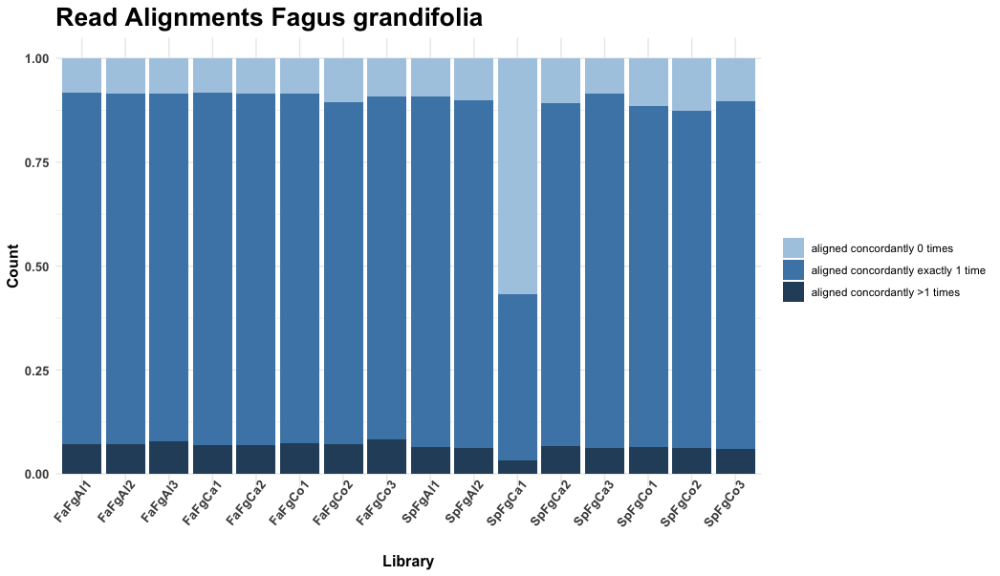

# bioscripts
A collection of bioinformatics utilities and visualization scripts written in R and Python by Alex Trouern-Trend.

<details>
<summary><b>Utilities</b></summary>

<details>
<summary><b>grabseqs.py</b> - Use a file of seqIDs and a multifasta for subsetting to a directed output. <br>&nbsp;&nbsp;&nbsp;&nbsp;&nbsp;&nbsp;&nbsp;&nbsp;&nbsp;&nbsp;&nbsp;&nbsp;<b>Requires: BioPython</b></summary>

```python
from Bio import SeqIO
import argparse

parser = argparse.ArgumentParser(
	prog='grabseqs.py',
	usage='''python grabseqs.py -f [Fasta file to subset] -l [list of headers representing desired subset] -o [output subset fasta]''', description='''This script produces a subet of a fasta file based on a text file containing sequence headers of interest.''',
	epilog='''Requirements: Biopython library''')

parser.add_argument("-f", "--fasta", type=str, help="The fasta file to be subset", required=True)
parser.add_argument("-l", "--list", type=str, help="A one-per-line texfile the headers to be taken from the fasta file.", required=True)
parser.add_argument("-o", "--out", type=str, help="The resulting subsetted fasta file.", required=True)

args = parser.parse_args()
fa = args.fasta
li = args.list
ou = args.out

wanted = set()
with open(li) as f:
    for line in f:
        line = line.strip()
        if line != "":
            wanted.add(line)

fasta_sequences = SeqIO.parse(open(fa),'fasta')
with open(ou, "w") as f:
    for seq in fasta_sequences:
        if seq.id in wanted:
            SeqIO.write([seq], f, "fasta")
```

</details>

</details>

<details>
<summary><b>Visualization</b></summary>

<details>
<summary><b>hisat_parser.R</b> - Parse statistical summaries from (HISAT2)[https://daehwankimlab.github.io/hisat2/] and visualize distribution of mapping rates across libraries. <br>&nbsp;&nbsp;&nbsp;&nbsp;&nbsp;&nbsp;&nbsp;&nbsp;&nbsp;&nbsp;&nbsp;&nbsp;<b>Requires: reshape2, ggplot2</b></summary>

```R
# Plant Computational Genomics Lab
# Author: Alex Trouern-Trend
# Date: May 25th, 2020

# Hisat2 output parser & stats

library(reshape2)
library(ggplot2)

setwd("~/Documents/scientist/projects/HBEF/Transcriptomics/genome-guided/hisat/")

outfa <- readLines("hisat-1099105.err")
outsp <- readLines("hisat-1099110.err")

lbfa <- c("FaFgAl1", "FaFgAl2", "FaFgAl3", "FaFgCa1", "FaFgCa2", "FaFgCo1", "FaFgCo2", "FaFgCo3" )
lbsp <- c("SpFgAl1", "SpFgAl2", "SpFgCa1", "SpFgCa2", "SpFgCa3", "SpFgCo1", "SpFgCo2", "SpFgCo3" )

hisat2_parser <- function(outfile, libnames) {
  header <- c("total_reads", "total_paired", "aligned concordantly 0 times", "aligned concordantly exactly 1 time", "aligned concordantly >1 times", "overall alignment rate")
  top <- grep("reads; of these:", outfile)
  a <- as.numeric(sub("^(\\d+).*", "\\1", outfile[top]))
  df <- data.frame("readcount" = a, stringsAsFactors = FALSE)
  nu <- 2:15
  for (i in nu) { df[i] <- as.numeric(trimws(sub("^(\\D*\\d+\\(?.\\d+).*", "\\1", outfile[top+(i-1)]))) }
  kp <- c(1,2,3,4,5,15)
  df <- df[kp]
  colnames(df) <- header
  rownames(df) <- libnames
  return(df)
}

sp <- hisat2_parser(outsp, lbsp)
fa <- hisat2_parser(outfa, lbfa)
bo <- rbind(fa, sp)

# Melt that bo fo a stack bar
bo["Library"] <- rownames(bo)
kp <-c(3,4,5,7)
bo2 <- bo[kp]
m_bo <- melt(bo2)

colors <- c("#2a4d69", "#4b86b4", "#adcbe3")

# Stacked Total
ggplot(m_bo, aes(fill=variable, y=value, x=Library)) + 
  geom_bar(position="stack", stat="identity") +
  theme_minimal() +
  scale_fill_manual(values=rev(colors)) +
  ylab("Count") +
  theme(plot.title = element_text(lineheight=.8, face="bold", size = 20),
        axis.title.x = element_text(face = "bold", size = 12),
        axis.title.y = element_text(face = "bold", size = 12),
        axis.text.y = element_text(face = "bold", size = 10),
        axis.text.x = element_text(face = "bold", size = 10, angle = 50, hjust = 1, vjust = 1.5),
        legend.title = element_blank()) +
  ggtitle("Read Alignments Fagus grandifolia")

# Stacked Fill
ggplot(m_bo, aes(fill=variable, y=value, x=Library)) + 
  geom_bar(position="fill", stat="identity") +
  theme_minimal() +
  scale_fill_manual(values=rev(colors)) +
  ylab("Count") +
  theme(plot.title = element_text(lineheight=.8, face="bold", size = 20),
        axis.title.x = element_text(face = "bold", size = 12),
        axis.title.y = element_text(face = "bold", size = 12),
        axis.text.y = element_text(face = "bold", size = 10),
        axis.text.x = element_text(face = "bold", size = 10, angle = 50, hjust = 1, vjust = 1.5),
        legend.title = element_blank()) +
  ggtitle("Read Alignments Fagus grandifolia")

```




</details>

</details>


